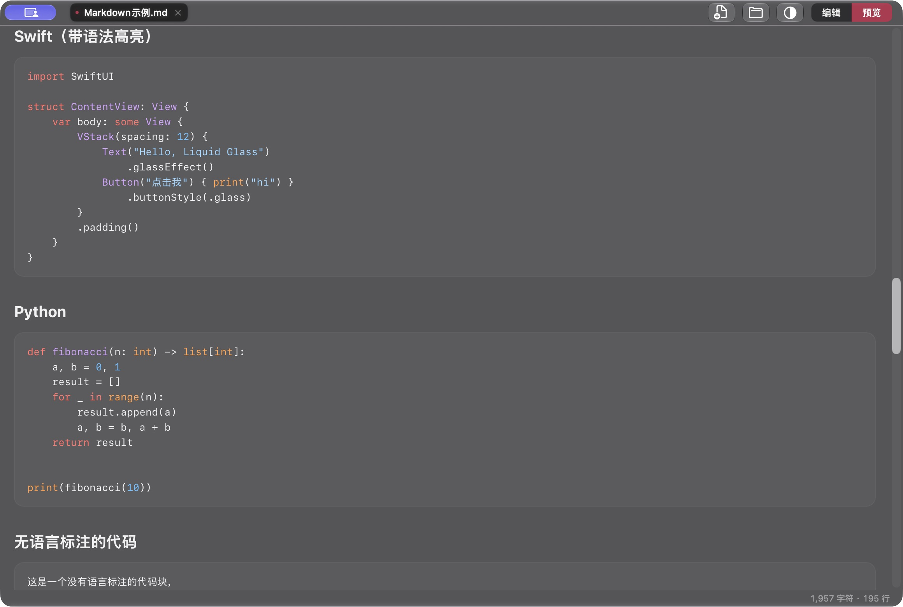
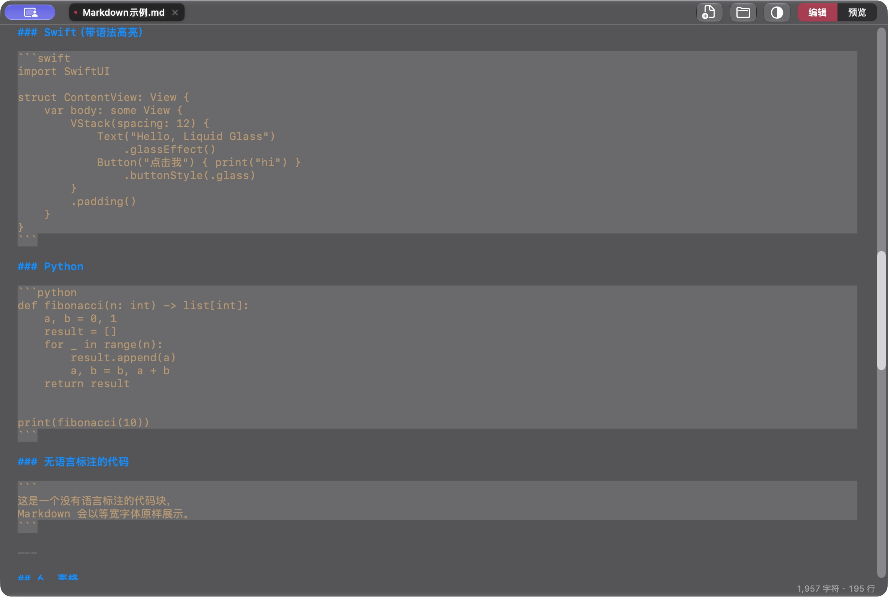

<div align="center">

# Markdown

**轻盈的 macOS 原生 Markdown 阅读与编辑器**

中文 · [English](README.en.md)

[下载最新版](https://github.com/Singularity-Li/markdown/releases/latest) · [反馈问题](https://github.com/Singularity-Li/markdown/issues) · [参与贡献](CONTRIBUTING.md)

macOS 26+ · Apple Silicon · Swift / SwiftUI · MIT 开源

</div>

---

## 专注文字，也照顾体验

打开一份笔记，读一篇长文，或修改项目文档。Markdown 将本地文件、清晰的排版和原生 macOS 交互放在一起，无需注册账号。

- **原生玻璃界面** — Liquid Glass 背景、可调透明度，跟随系统明暗外观；紧凑工具栏为正文留出空间。
- **阅读与编辑，随时切换** — 排版预览与 Markdown 源码高亮；切换模式时尽量保留阅读位置，键盘焦点自动进入正文。
- **多文档，一处管理** — 标签页、文件多选、批量拖放与文件夹侧栏；每份文档独立保留模式和未保存状态。
- **常用 Markdown 开箱即用** — 表格、任务列表、代码高亮、图片、引用与标题锚点；支持自定义 HTML 锚点和相对路径图片。
- **本地文件，自由掌握** — 直接读写纯文本，无专有格式；渲染器内置，阅读本地文本无需联网。正文实时显示字符数和行数。
- **保存保护与应用更新** — 关闭或退出前提醒保存；通过 Sparkle 检查、验签并安装更新，更新重启后恢复已记录的文件标签。

## 界面一览

**阅读模式** · 内置代码高亮，专注正文。



**编辑模式** · Markdown 源码高亮与即时切换



<sub>两张截图均来自根目录 App 实际运行，使用仓库示例文档；点击图片可查看原始分辨率。</sub>

## 下载与开始

1. 在 [Releases](https://github.com/Singularity-Li/markdown/releases/latest) 下载 `Markdown-X.Y.Z.zip`。
2. 解压后将 `Markdown.app` 放入“应用程序”，启动一次。
3. 拖入 Markdown 文件或文件夹，或按 `⌘O` 打开；按 `⇧⌘P` 切换编辑与预览。

需要 **macOS 26 或更新版本、Apple Silicon 芯片**。当前发行包采用 ad-hoc 签名，尚未经过 Apple Developer ID 签名或公证，macOS 可能提示无法验证开发者。请确认下载来源；也可以自行从源码构建。

后续可在 **Markdown → 检查更新…** 中更新。完整版本说明见 [发布记录](https://github.com/Singularity-Li/markdown/releases)。

| 快捷键 | 操作 |
| :--- | :--- |
| `⌘N` | 新建文档 |
| `⌘O` | 打开文件或文件夹 |
| `⌘S` | 保存当前文档 |
| `⌘W` | 关闭当前标签 |
| `⇧⌘P` | 切换编辑 / 预览 |

## 支持范围

预览使用 Marked 的 GitHub Flavored Markdown 模式，代码高亮由 highlight.js 提供。源码中对公式、脚注等标记的高亮，不代表预览支持公式排版或脚注扩展；目前不包含 PDF 导出、云同步或协同编辑。界面目前以中文为主。

渲染器可以离线工作，但远程图片及内嵌远程内容会连接相应站点，更新检查会连接 GitHub。应用不要求账号，项目未接入使用行为分析服务。请仅预览可信文档，详见 [隐私与安全说明](SECURITY.md)。

## 从源码构建

准备 macOS 26+、Apple Silicon 和包含 macOS 26 SDK / Swift 6.2 的 Xcode 工具链，首次解析依赖需要联网：

```sh
git clone https://github.com/Singularity-Li/markdown.git
cd markdown
bash scripts/build_app.sh
bash scripts/test.sh
open Markdown.app
```

构建只在仓库根目录生成 `Markdown.app`，并完成本地签名、图标与更新配置检查。不需要维护者的更新私钥。详细流程见 [贡献指南](CONTRIBUTING.md)。

## 开源与贡献

本项目的原创源码、文档与资源采用 [MIT 许可证](LICENSE)，允许使用、修改、分发和商业使用，须保留许可声明。第三方组件遵循各自的开源许可，详见 [第三方声明](THIRD_PARTY_NOTICES.md)。macOS SDK 与系统框架由 Apple 提供，本项目未将其重新许可为 MIT。

欢迎提交可复现的问题、文档修正和小而完整的 Pull Request。开始前请阅读 [贡献指南](CONTRIBUTING.md)、[社区行为准则](CODE_OF_CONDUCT.md) 和 [安全报告说明](SECURITY.md)。
